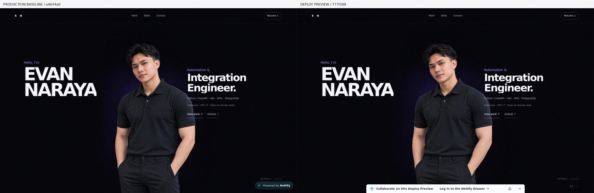
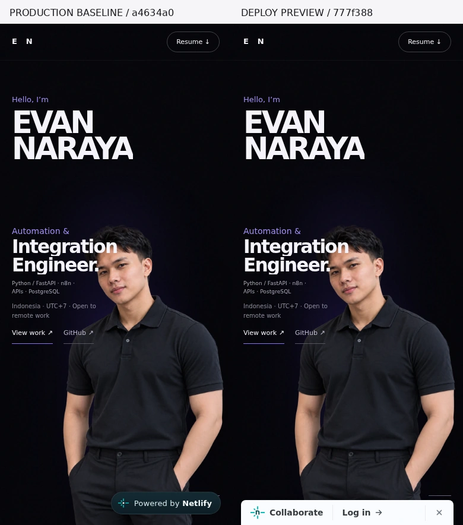
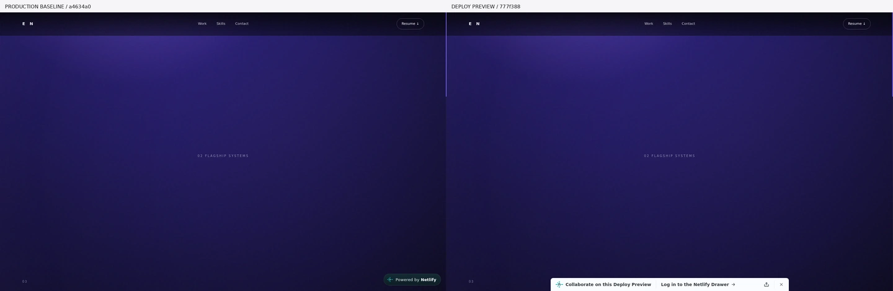
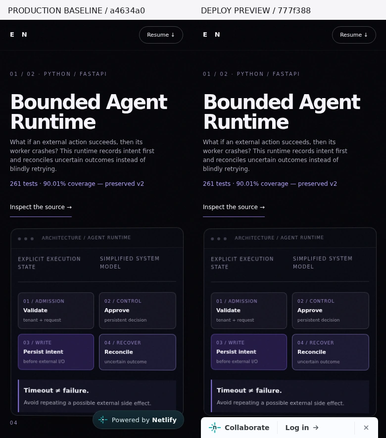

# Owner release review — 8 October 2026

**Working engineering preview; production release held.** The existing site and repository are retained. The strict visual lock is respected. Authentic original resumes are prepared and tested locally, but their public upload needs explicit contact-data authorization. General CI passing does not resolve this blocker.

## A. Audit

The detailed [audit](audit.md) lists classification, severity, root cause, code location, affected viewport and verification for each substantial finding. Corrections cover reduced-motion link interaction, keyboard focus in faded scenes, keyboard access to architecture scroll regions, idle pointer animation, no-JavaScript readability, independently loadable assets and revision-pinned evidence links.

Deferred under the visual lock: mobile role/portrait overlap, hidden mobile navigation, long cinematic travel and small architecture-label contrast. No colors, typography, spacing, section order, photo cropping or ordinary scroll interpolation were changed. No WCAG AA compliance or recruiter conversion claim is made.

The previous 7 October screen recording was not loaded or used as evidence. The newly inspected production website takes precedence. Client outcomes, country-specific work authorization, field INP and inbox deliverability remain unverified.

## B. Engineering

[Draft PR #1](https://github.com/naraya07pedro-spec/evan-naraya-portfolio/pull/1) targets existing `main` from `chore/portfolio-engineering-upgrade-20261008`.

Application commits: `e1f68585d6cc937d093d9e899d43195159989cd1` extracts assets and hardens interaction without visible redesign; `777f388ba5167f742cb8f9f56ac2f274e832ba13` adds the verification workflow, documentation and explicit resume release gate. Subsequent review-documentation/capture-tooling changes do not modify website assets. Consult the PR for its final head and CI status.

| Changed source | Purpose |
| --- | --- |
| `index.html` | Semantic regions, accessible names, hidden factual limitations, existing image preload, metadata and external asset references |
| `assets/css/portfolio.css` | Original styles plus keyboard/reduced-motion and screen-reader-only rules |
| `assets/js/portfolio.js` | Preserved animation equations; conditional style writes, sleeping pointer RAF and keyboard scene visibility |
| `assets/images/evan-naraya-portrait.webp` | Exact original 101,116-byte portrait, unchanged hash/aspect ratio |
| `assets/resumes/*.pdf` | Exact existing public baseline PDFs extracted from data URIs; original replacement pending authorization |
| `netlify.toml`, `.netlifyignore`, `robots.txt`, `sitemap.xml` | Static existing-project deployment, limited defensive headers and discovery metadata |
| `package.json`, lockfile, `.gitignore`, `scripts/`, `tests/`, `.github/workflows/quality.yml` | Pinned development-only tooling and meaningful structural, browser, accessibility and visual gates |
| `README.md`, `docs/` | Architecture, source/evidence map, honest limitations, resume provenance, measurements, screenshots and rollback |

Executed locally: **6 structural tests, 16 browser tests, 98 screenshot comparisons**; no failures. Both Chromium and Firefox exercised the immutable baseline and proposal at all seven widths. Complete original-PDF proposal tests also passed locally before its privacy-blocked upload. The safe public branch tests the unchanged baseline PDFs.

[GitHub Actions run 37768521076](https://github.com/naraya07pedro-spec/evan-naraya-portfolio/actions/runs/37768521076) completed successfully at exact application head `777f388…`: dependency installation, both browser engines, structure, E2E, visual comparison and artifact upload all succeeded. Final branch-head CI must also pass before any owner release decision.

Live preview Chromium E2E separately passed keyboard/CTA navigation, both PDF downloads and hashes, focused scene visibility, live reduced-motion changes, touch/reflow and axe regression scanning. No JavaScript runtime failures or failed app requests were observed. Firefox live-site TLS trust in this managed QA runtime remained blocked; local and GitHub-hosted Firefox tests passed. TLS certificate verification was not disabled.

`npm run verify:release` **fails intentionally**: neither public PDF equals its authentic approved original. [Proposed original provenance](resumes.json) and [currently published provenance](published-resumes.json) are distinct.

## C. Design and accessibility evidence

Required widths: **320, 375, 390, 768, 1024, 1440 and 1920 px**. Real production and preview captures include hero, statement, planetary entry/expansion, both flagship scenes, contact and full-page views. Controlled source comparison additionally covers Firefox.

[98 controlled comparisons](qa/source-regression.json) had **zero changed pixels** with no application masks. [49 actual hosted comparisons](qa/hosted-comparison.json) were unmasked: differences were confined to the bottom 56 px occupied by production's Netlify badge versus the preview review toolbar. No other pixel differences passed the same pixelmatch threshold. This is not a claim that the hosting UI is visually identical or that content behind its overlays was compared.

Production is on the left; the actual hosted preview is on the right:

[390 px full page](qa/preview-390-full.webp) · [1440 px full page](qa/preview-1440-full.webp). Sticky scenes depend on scroll state; the viewport screenshots are the authority for their appearance.

[Capture record](qa/preview-capture.json) discloses a first wide-screen `networkidle` timeout. A second capture completed after application fonts/images decoded, recording that hosting traffic did not become idle. This did not produce a runtime or asset error. The capture tool now reports this condition instead of discarding completed evidence.

[Live axe evidence](qa/accessibility-chromium.json) shows no new violations versus the baseline and removal of the unfocusable architecture regions. Existing contrast defects remain. Automated checks do not establish full WCAG compliance or measured animation smoothness on physical low-power devices.

## D. Performance

Final single-run Lighthouse 13.5.0 / Chromium 153.0.8010.0 comparison on localhost, with cinematic animation enabled. Mobile is 390×844; desktop viewport is 1440×900. Both use simulated 150 ms RTT, 1,474.56 Kbps download and 4× CPU slowdown; desktop is not the standard desktop preset. [Measurement record](qa/performance.json).

| Metric | Mobile before → after | Desktop viewport before → after |
| --- | --- | --- |
| Performance | 99 → 99 | 74 → 90 |
| Accessibility | 95 → 96 | 100 → 100 |
| Best practices / SEO | 100 / 100 → 100 / 100 | 100 / 100 → 100 / 100 |
| LCP | 1.606 → 1.803 s | 1.617 → 1.806 s |
| CLS | 0 → 0 | 0 → 0 |
| TBT | 0 → 0 ms | 309.5 → 29.24 ms |
| JavaScript execution | 15.42 → 16.48 ms | 19.35 → 16.58 ms |
| Initial transferred bytes | 190,749 → 145,895 | 190,749 → 145,895 |

Initial bytes fell about 23.5%; HTML fell from 190,539 to 16,465 bytes. LCP became roughly 0.2 seconds slower; separating resources is a request tradeoff, not an unconditional speed improvement. Single runs contain noise. No field Core Web Vitals, measured INP or commercial reliability outcome is claimed. Preserved blur/grain/sticky rendering remains a cost.

## E. Deployment and rollback

Verified application preview: https://deploy-preview-1--evannaraya.netlify.app/ ; Netlify deploy `6ac77a93cece04000834c8d9`, ready, context `deploy-preview`, commit_ref `777f388ba5167f742cb8f9f56ac2f274e832ba13`, site `8d6b74f1-81c1-46e4-9a10-c3cda7c18bbe`. Final documentation commit will produce another preview on the same PR/site.

[Deployed assets](qa/deployed-assets.json) all match the repository byte-for-byte, including portrait and both currently public PDF downloads. CSS/JS/image/PDF content types are correct. Dependency, test-artifact and `.git/config` probes returned 404. [Actual response headers](qa/preview-headers.txt) include preview `noindex`, the existing framing/MIME/referrer protections, unused capability restrictions and the added limited CSP. Full script-restricting CSP is deferred because Netlify injects hosting UI; the policy is not presented as complete XSS protection. No tracker was introduced.

Production is unchanged: `main` at `a4634a0e4161ca8667c873cc4f26c5c65041dca0`, published ready deploy `6ac76d9a8f678c5c17a6cf53`. No merge, auto-merge or production publication was performed. Existing domain, site ID, production branch, publish directory and absent build command remain.

[Rollback instructions](deployment.md) retain the exact baseline deploy and a reviewed Git revert path. Any restore/merge requires owner authorization.

## F. Recruiter walkthrough and release recommendation

This is an engineering walkthrough, not research with invented recruiter participants.

| Review objective | Assessment |
| --- | --- |
| Role within 30 seconds | Existing first screen exposes name, role, stack, Indonesia/UTC+7, GitHub and resume access. Mobile overlap remains a known scan limitation. |
| Suitable project within 60 seconds | Existing work CTA and two flagship narratives explain real failure, decision and implementation. Long scroll travel is preserved, not a measured timing success. |
| Source/tests within 90 seconds | Project destinations plus [evidence map](evidence-map.md) expose architecture, source, tests, CI, exact verified revisions and limitations. Actual reviewer completion time is unmeasured. |
| Current authentic resumes | **Blocked publicly.** Both originals were found, rendered, checked and downloaded locally. Preview retains the older public PDFs pending authorization. Both current public files open in the real browser PDF viewer. |
| Contact | Existing business mailto, GitHub and LinkedIn destinations are unchanged. Inbox deliverability and independently refreshed social profile content are unverified. No test email was sent. |
| References vs client delivery | Archived v2 evidence and knowledge's lexical/extractive synthetic evaluation limits are explicit. Private client scope stays self-reported. No commercial scale, exactly-once, tenure or MAXY completion was invented. |

**Hold production release.** Authorize publication of both authentic named v3 PDFs and their contact information to the public repository and Netlify preview/site first. Then replace only those assets, rerun original-file/download/release gates, recheck final CI and hosted preview, and request separate approval for the exact production merge commit. Visual UX changes remain outside this upgrade's authorization.
